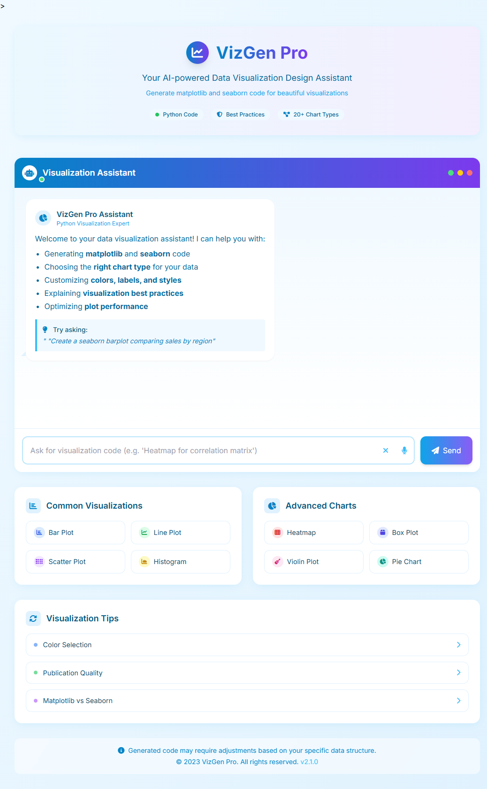

# 🚀 VizGen Pro – AI-powered Data Visualization Design Assistant

**VizGen Pro** is an intelligent web application that helps users generate clean, well-commented Python code for data visualizations using libraries like **matplotlib** and **seaborn**. Powered by the **Gemini 2.0 API**, it simplifies the process of designing professional visualizations with guidance on best practices, chart types, and more.

---

## 🧠 Features

- 🎯 AI-powered assistant trained for Python data visualization
- 🧰 Supports 20+ chart types (bar, line, heatmap, pie, violin, etc.)
- 🎨 Custom UI built with Tailwind CSS and Font Awesome
- 🎤 Voice input via Web Speech API
- 🧑‍💻 Generates matplotlib and seaborn code with explanations
- ✨ Animated UI with chat-style interaction

---

## 💻 Tech Stack

- **Frontend:** HTML, CSS, Tailwind CSS, JavaScript  
- **AI Backend:** Google Gemini 2.0 API (`generateContent` endpoint)  
- **Voice Input:** Web Speech API  
- **Icons & UI:** Font Awesome, Custom CSS

---

## 🛠️ How to Run Locally

1. Clone the repository:
   ```bash
   git clone https://github.com/your-username/vizgen-pro.git
   cd vizgen-pro
   ```

2. Open `index.html` in your browser.

3. ⚠️ Replace the API key in `script.js` or inline script section with your own **Gemini 2.0 API key**.

---

## 🔐 API Key Setup

Replace the placeholder in the script with your actual API key:

```javascript
const API_KEY = 'your-api-key-here';
```

Sign up for Gemini API access [here](https://makersuite.google.com/).

---

## 👨‍💻 Contributors

- [@Likhith](https://github.com/Likhith001)
- [@Meher](https://github.com/meher450) 

---

## 📄 License

This project is licensed under the [MIT License](LICENSE).

---

## 🙌 Acknowledgements

- Google Gemini 2.0 for the AI model
- Tailwind CSS for beautiful styling
- Font Awesome for icons

---

> 🔥 Ready to take your visualizations to the next level with the power of AI!

Here is the glimpse of the interface and a working demo video




```
